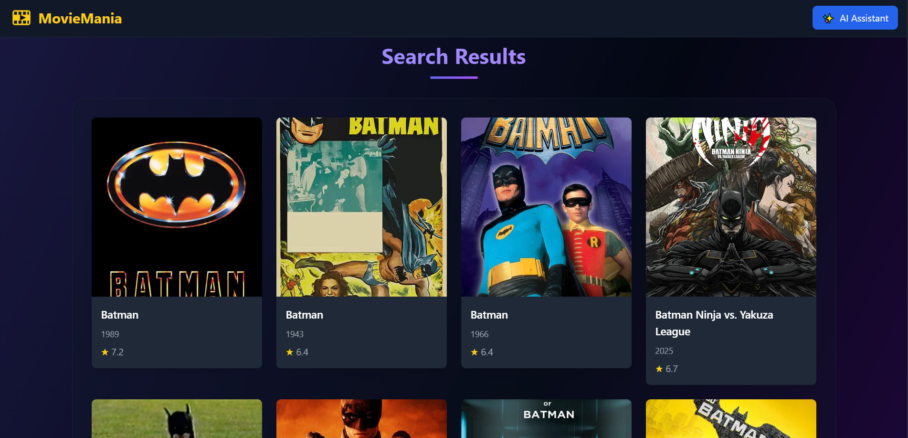
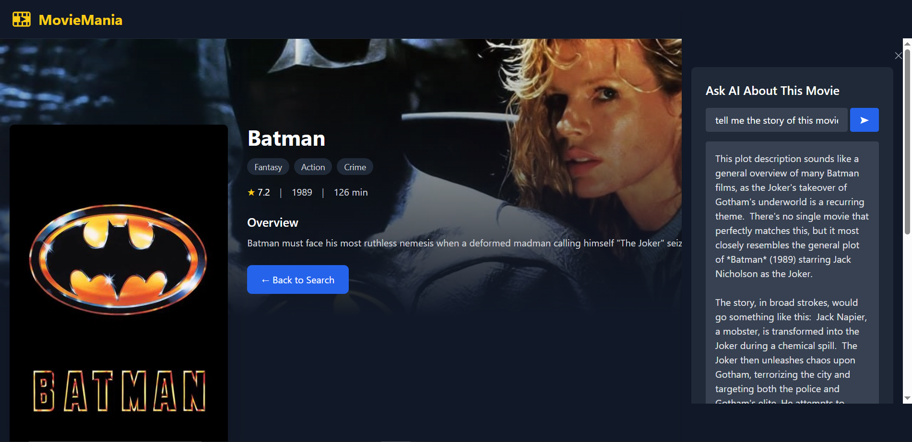

# 🎬 MovieMania - An AI Powered Movie Search App

A modern React web application to search movies using [TMDB API](https://www.themoviedb.org/documentation/api), view detailed information, and interact with an AI assistant (powered by Gemini) for movie-related queries.

---

## ✨ Features

- **Movie Search:** Search for movies by title using TMDB.
- **Attractive UI:** Responsive, dark-themed interface.
- **Movie Details:** View posters, genres, ratings, release dates, and overviews.
- **AI Assistant:**  
  - Accessible from a floating side panel via the navigation bar.  
  - Ask general or movie-specific questions (e.g., "Summarize this movie", "What genre is this?", "Is this suitable for kids?").
  - Context-aware: On a movie page, the assistant uses the current movie's details.
- **Global State Management:** Uses React Context for sharing movie details across components.
- **Loading & Error Handling:** User-friendly loaders and error messages.

---

## 🚀 Getting Started

### 1. **Clone the repository**

```bash
git clone https://github.com/your-username/movie-search-ai.git
cd movie-search-ai
```

### 2. **Install dependencies**

```bash
npm install
```

### 3. **Set up environment variables**

Create a `.env` file in the root directory:

```
VITE_TMDB_API_KEY=your_tmdb_api_key_here
VITE_GEMINI_API_KEY=your_gemini_api_key_here
```

- [Get a TMDB API key](https://www.themoviedb.org/settings/api)
- [Get a Gemini API key](https://aistudio.google.com/app/apikey) 

### 4. **Run the app**

```bash
npm run dev
```

Open [http://localhost:5173](http://localhost:5173) in your browser.

---

## 🤖 AI Assistant

- **Access:** Click the `✨ AI Assistant` button in the navbar to open the side panel.
- **Context-aware:**  
  - On the home page, ask general movie questions.
  - On a movie details page, ask about the current movie.
- **Powered by:**  
  - [Google Gemini API](https://aistudio.google.com/app/apikey)

---

---

## 📸 Screenshots

| Home Page | Movie Details | AI Assistant Panel |
|-----------|---------------|-------------------|
|  |  |  |

---


> Made with ❤️ for movie lovers and AI enthusiasts!
